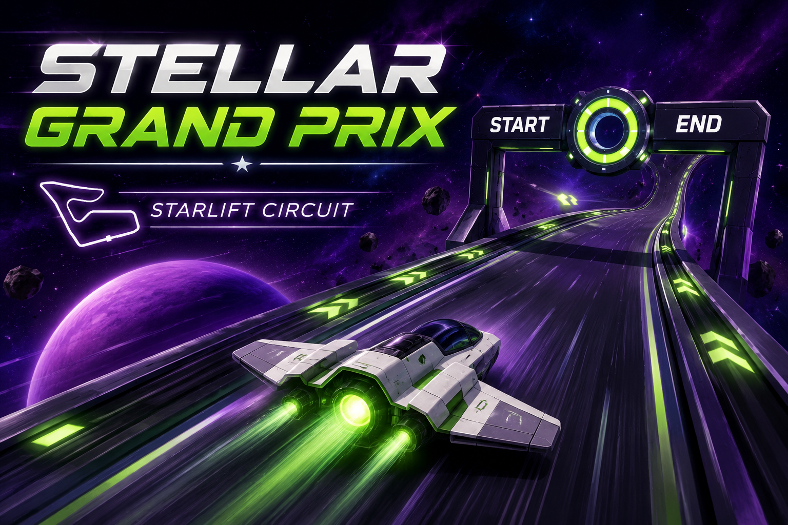
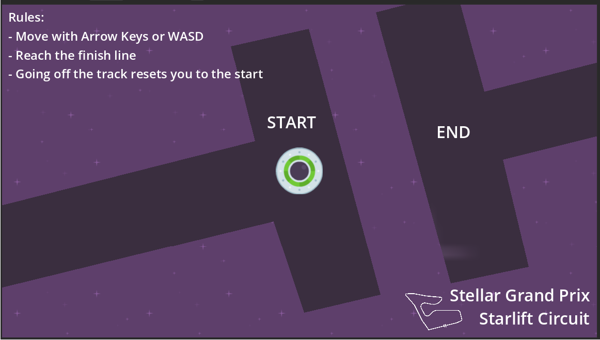

<p align="center">
  
</p>

<h1 align="center">🚀 Stellar Grand Prix</h1>

<p align="center">
  A fast-paced 2D arcade racing game where anti-gravity spacecraft compete on futuristic circuits across the galaxy.
</p>

<p align="center">
Built with <strong>Godot Engine 4</strong>, Stellar Grand Prix delivers responsive controls, high-speed gameplay, and a sci-fi atmosphere inspired by classic arcade racing games.
</p>

<p align="center">
  <a href="https://cleoaguiar.itch.io/stellar-grand-prix">
    
    
    
    
    
  </a>
</p>

---

## 📸 Preview



---

## 🎮 Play the Game

Play **Stellar Grand Prix** on Itch.io:

https://cleoaguiar.itch.io/stellar-grand-prix

---

## ✨ Features

- 🚀 Fast-paced arcade racing gameplay
- 🌌 Futuristic space-themed circuit
- 🎯 Responsive keyboard controls
- 👆 Swipe gesture controls for touch devices
- 📱 Responsive window scaling for different screen sizes
- 🖼️ Adaptive background layout
- 🛸 Sci-fi visual style
- ⚡ Built with Godot Engine 4

---

## 🛠 Built With

- Godot Engine 4
- GDScript
- Git & GitHub

---

## 🎮 Controls

### Desktop

| Action | Keyboard |
|---------|----------|
| Accelerate | ↑ |
| Brake / Reverse | ↓ |
| Turn Left | ← |
| Turn Right | → |

### Mobile / Touch Devices

| Action | Gesture |
|---------|---------|
| Accelerate | Swipe Up |
| Brake / Reverse | Swipe Down |
| Turn Left | Swipe Left |
| Turn Right | Swipe Right |

The game automatically adapts the interface and input handling depending on the device.

---

## 📱 Responsive Design

Stellar Grand Prix supports different screen sizes through responsive window scaling and adaptive background positioning.

The game is designed to maintain consistent gameplay across desktop and touch devices, providing a smooth experience on different resolutions.

---

## 📂 Project Organization

The project is organized into:

```text
├── assets/        # Visual assets
├── docs/          # Documentation and screenshots
├── scenes/        # Game scenes
├── scripts/       # GDScript files
└── project.godot  # Godot project configuration
```

As development continues, additional folders for audio, UI, and game content may be added to keep the project scalable and maintainable.

---

## 🚀 Getting Started

Clone the repository:

```bash
git clone https://github.com/CleoAguiar/stellar-grand-prix.git
```

Open the project with **Godot Engine 4** and press **F5** to run.

---

## 🗺️ Roadmap

- [x] Responsive window scaling
- [x] Adaptive background layout
- [x] Mobile swipe gesture controls
- [ ] Additional race tracks
- [ ] More spacecraft
- [ ] Boost mechanics
- [ ] Improved user interface
- [ ] Sound effects and music

---

## 📈 Project Status

🚧 **Active Development**

Stellar Grand Prix is under continuous development, with improvements focused on gameplay mechanics, accessibility, visual polish, and new racing content.

---

## 🤝 Contributing

Suggestions, bug reports, and feedback are always welcome.

Feel free to open an Issue or submit a Pull Request.

---

## 📄 License

This project is licensed under the MIT License.

---

## 👤 Author

**Cleo Aguiar**

Game Developer | Java Backend Developer

GitHub: https://github.com/CleoAguiar

Itch.io: https://cleoaguiar.itch.io

---

⭐ If you enjoyed this project, consider giving it a star!
